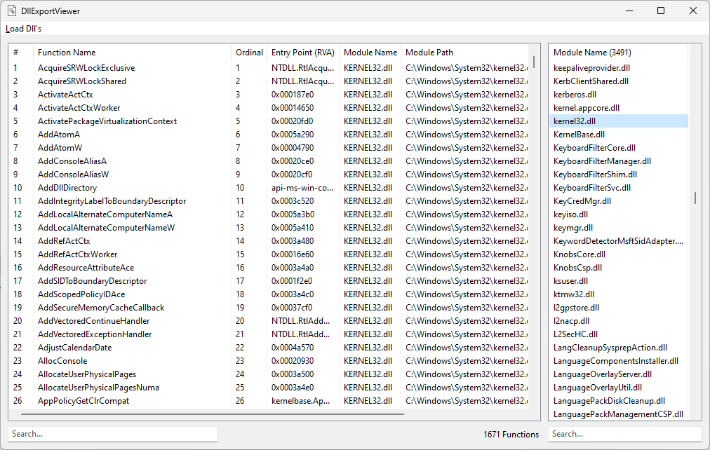
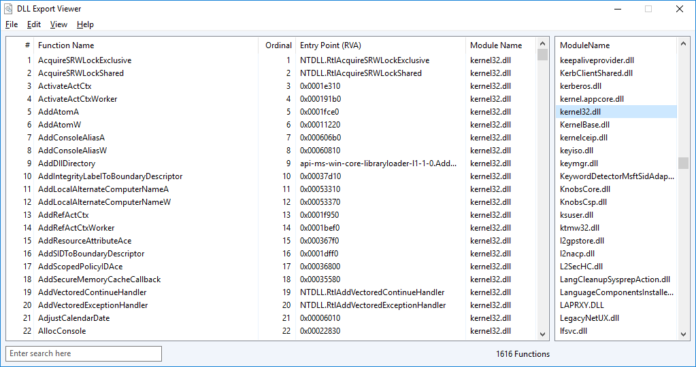
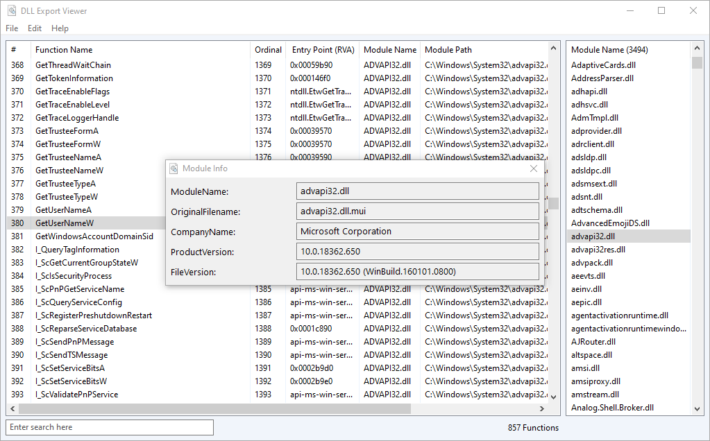

# AHK Dll Export Viewer
Displays a list of all exported functions for the specified Dll files.

## Features
* Displays the name of the function
* Displays the ordinal of the function
* Displays the entry point (the relative address) of the function or its forward string
* Load common dll's / use drag and drop / filter by searchbar

## Example

## Info
* [AHK Thread](https://autohotkey.com/boards/viewtopic.php?t=34262)
* [MapAndLoad](https://msdn.microsoft.com/en-us/library/ms680353(v=vs.85).aspx) & [UnMapAndLoad](https://msdn.microsoft.com/en-us/library/ms681404(v=vs.85).aspx)
* [ImageDirectoryEntryToData](https://msdn.microsoft.com/en-us/library/ms680148(v=vs.85).aspx)
* [ImageRvaToVa](https://msdn.microsoft.com/en-us/library/ms680218(v=vs.85).aspx)
* [LoadLibrary](https://msdn.microsoft.com/en-us/library/ms684175(v=vs.85).aspx) / [LoadLibraryEx](https://msdn.microsoft.com/en-us/library/ms684179(v=vs.85).aspx) & [FreeLibrary](https://msdn.microsoft.com/en-us/library/ms683152(v=vs.85).aspx)
* [PE Format Layout](https://drive.google.com/file/d/0B3_wGJkuWLytbnIxY1J5WUs4MEk/view)
* [Export Table](https://win32assembly.programminghorizon.com/pe-tut7.html)

## Contributing
* thanks Bentschi for LoadLibrary()
* thanks SKAN for DllListExports()
* thanks 'just me' for GetNamedDllExports() and his testings
* thanks Alguimist for his gui design idea

## Inspired by
* [Dependency Walker](http://www.dependencywalker.com/)
* [DLL Export Viewer](http://www.nirsoft.net/utils/dll_export_viewer.html) by NirSoft

## Questions / Bugs / Issues
If you notice any kind of bugs or issues, report them on the [AHK Thread](https://autohotkey.com/boards/viewtopic.php?t=34262). Same for any kind of questions.

## Copyright and License
[MIT License](LICENSE)

## Donations
[Donations are appreciated if I could help you](https://www.paypal.me/smithz)